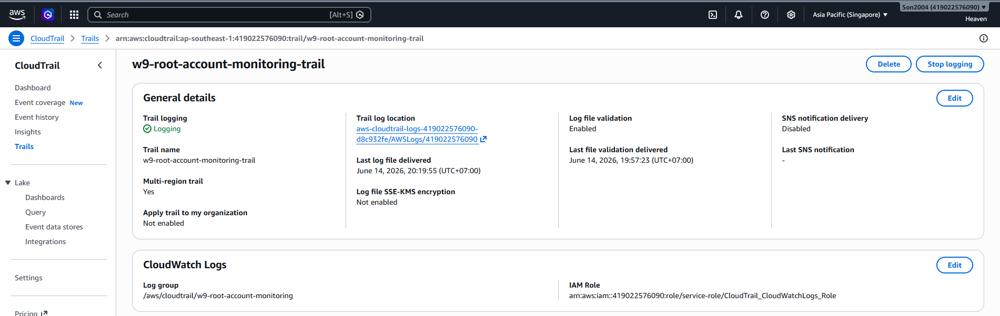
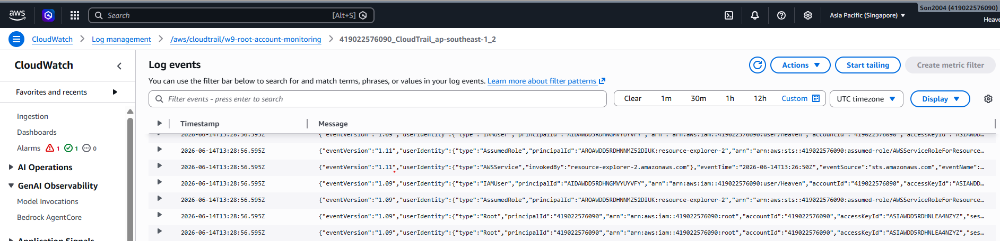
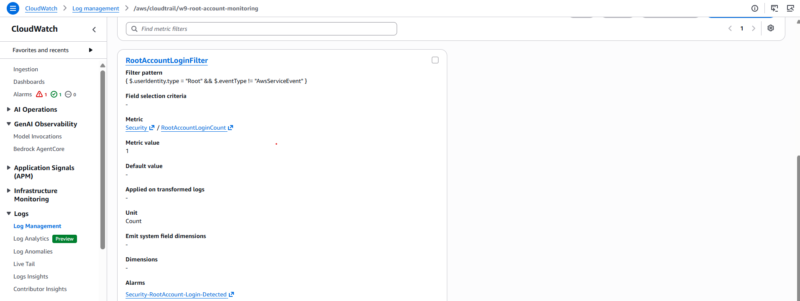
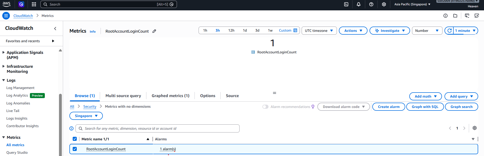
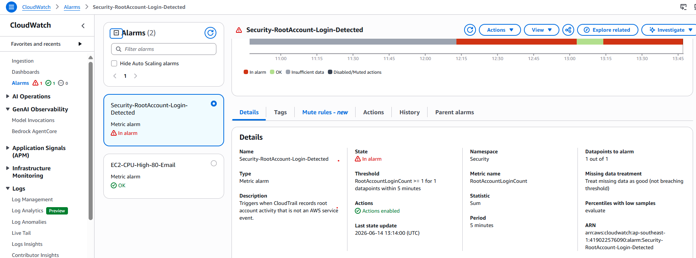
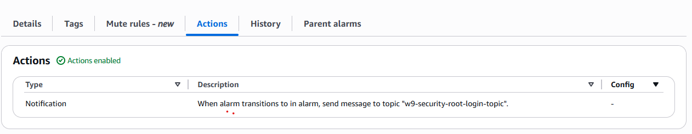
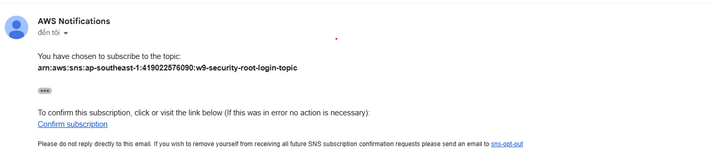
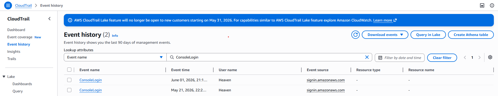
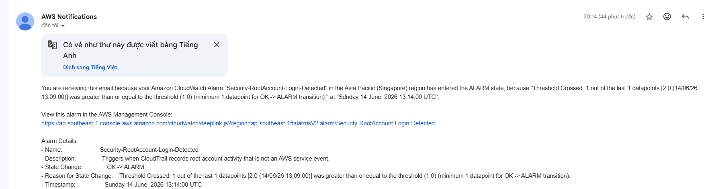

# Evidence - Alert on AWS Root Account Login

This evidence file explains and documents the security monitoring control for AWS root account usage. The goal is not only to show screenshots, but to make the reviewer understand why each piece matters and how the alert path works.

Save screenshots under:

```text
cloud/w9/mornitoring/Alert-on-AWS-Root-Account-Login/docs/image/
```

## What This Evidence Proves

The lab is complete when a CloudTrail event from the AWS root account can flow into CloudWatch Logs, match a metric filter, increment the `Security/RootAccountLoginCount` metric, trigger a CloudWatch alarm, and notify the security team through SNS.

In plain language:

```text
If root is used, the security team gets notified.
```

## Environment

| Item | Value |
| --- | --- |
| AWS Region | `ap-southeast-1` |
| Trail | `w9-root-account-monitoring-trail` |
| CloudWatch Logs group | `/aws/cloudtrail/w9-root-account-monitoring` |
| Metric filter | `RootAccountLoginFilter` |
| Metric namespace | `Security` |
| Metric name | `RootAccountLoginCount` |
| Alarm | `Security-RootAccount-Login-Detected` |
| SNS topic | `w9-security-root-login-topic` |
| Notification target | Security email, optional SMS |

## Acceptance Criteria

| Requirement | Expected result | Status |
| --- | --- | --- |
| CloudTrail delivery | Trail sends management events to CloudWatch Logs | Passed |
| Log group | CloudTrail events are visible in the configured log group | Passed |
| Metric filter | Filter pattern detects root activity excluding AWS service events | Passed |
| Custom metric | Matching events publish `Security/RootAccountLoginCount = 1` | Passed |
| Alarm | Alarm triggers when metric sum is `>= 1` in 5 minutes | Passed |
| SNS notification | Alarm sends notification to the security SNS topic | Passed |
| Email/SMS | Security recipient receives alert notification | Passed |

## Evidence Summary

| No. | Evidence | File | Status |
| --- | --- | --- | --- |
| 01 | CloudTrail trail sends events to CloudWatch Logs | `docs/image/01-cloudtrail-cloudwatch-logs.png` | Captured |
| 02 | CloudTrail log group receives events | `docs/image/02-cloudtrail-log-events.png` | Captured |
| 03 | Metric filter pattern detects root account usage | `docs/image/03-root-metric-filter.png` | Captured |
| 04 | Custom metric is created in namespace `Security` | `docs/image/04-security-metric.png` | Captured |
| 05 | Alarm condition is `RootAccountLoginCount >= 1` | `docs/image/05-root-login-alarm-condition.png` | Captured |
| 06 | Alarm action sends to SNS topic | `docs/image/06-alarm-sns-action.png` | Captured |
| 07 | SNS topic and confirmed subscription | `docs/image/07-sns-security-subscription.png` | Captured |
| 08 | Root activity test or CloudTrail root event | `docs/image/08-root-event-detected.png` | Captured |
| 09 | Alarm entered `ALARM` state | Confirmed by alert notification evidence | Documented |
| 10 | Email/SMS notification received | `docs/image/10-root-alert-notification.png` | Captured |

## Evidence Details

### 01 - CloudTrail Sends Events to CloudWatch Logs

This evidence proves that CloudTrail is not only writing to S3, but also delivering events to a CloudWatch Logs log group. This is required because CloudWatch Logs metric filters work on log groups, not directly on the CloudTrail console event history.

Expected:

- Trail name is `w9-root-account-monitoring-trail`.
- Management events are enabled.
- CloudWatch Logs delivery is enabled.
- Log group is `/aws/cloudtrail/w9-root-account-monitoring`.
- Delivery role is visible, usually `CloudTrail_CloudWatchLogs_Role`.



### 02 - CloudTrail Log Events Arrive

This evidence proves that the log group is receiving real CloudTrail JSON events. Without this, the metric filter can exist but never match anything.

Expected:

- Log group `/aws/cloudtrail/w9-root-account-monitoring` exists.
- A recent log stream exists.
- At least one CloudTrail event is visible.
- Event fields such as `eventTime`, `eventName`, `eventSource`, and `userIdentity` are visible.



### 03 - Root Account Metric Filter

This evidence proves that CloudWatch Logs is looking for the correct security signal.

Required filter pattern:

```text
{ $.userIdentity.type = "Root" && $.eventType != "AwsServiceEvent" }
```

Why this matters:

- `userIdentity.type = "Root"` identifies root account usage.
- `eventType != "AwsServiceEvent"` avoids alerting on AWS service-generated events.

Expected:

- Filter name is `RootAccountLoginFilter`.
- Filter pattern matches the required pattern exactly.



### 04 - Security Metric

This evidence proves that matching log events become a CloudWatch metric that an alarm can evaluate.

Expected:

- Metric namespace is `Security`.
- Metric name is `RootAccountLoginCount`.
- Metric value is `1`.
- Unit is `Count` if selected.

Interpretation:

```text
Every matching root event adds 1 to RootAccountLoginCount.
```



### 05 - Root Login Alarm Condition

This evidence proves that the alarm is strict enough for root account usage.

Expected:

- Alarm name is `Security-RootAccount-Login-Detected`.
- Metric is `Security / RootAccountLoginCount`.
- Statistic is `Sum`.
- Period is `5 minutes`.
- Threshold is `Greater than or equal to 1`.
- Evaluation is `1 out of 1 datapoints`.
- Missing data is treated as not breaching.

Why `>= 1` matters:

```text
Any single root event in a 5-minute period triggers the alarm.
```



### 06 - Alarm SNS Action

This evidence proves that detection is connected to notification. An alarm without an action is only visible when someone opens the console; an alarm with SNS can notify the team immediately.

Expected:

- Alarm state trigger is `In alarm`.
- SNS topic is `w9-security-root-login-topic`.
- Optional OK notification may use the same topic.



### 07 - SNS Security Subscription

This evidence proves that SNS has at least one confirmed recipient.

Expected:

- SNS topic is `w9-security-root-login-topic`.
- Email subscription is `Confirmed`.
- Optional SMS subscription is present if SMS was configured.

If email is still `Pending confirmation`, the alert path is not complete.



### 08 - Root Event Detected

This evidence proves the source security event exists. If a controlled root sign-in was allowed, this screenshot should show the root event in CloudTrail or CloudWatch Logs.

Expected CloudTrail fields:

```text
userIdentity.type: Root
eventName: ConsoleLogin
eventType: AwsConsoleSignIn
```

If your security process does not allow a real root sign-in test, document that testing was skipped and rely on configuration evidence from the metric filter, alarm, and SNS action.



### 09 - Alarm State ALARM

This evidence proves that CloudWatch evaluated the custom metric and detected root account usage.

Expected:

- Alarm name is `Security-RootAccount-Login-Detected`.
- State is `ALARM` or `In alarm`.
- State reason mentions `RootAccountLoginCount`.
- Datapoint is `>= 1`.

No separate screenshot was included for this step. The `ALARM` transition is documented through the alert notification evidence, because the notification is only sent after CloudWatch moves the alarm into `ALARM` state and executes the SNS action.

### 10 - Email/SMS Notification Received

This evidence proves that the alert reached the security recipient.

Expected:

- Email or SMS notification is received.
- Alarm name is visible.
- New state is `ALARM`.
- Region and AWS account are visible if possible.
- Timestamp is visible if possible.



## Verification Commands

Optional AWS CLI checks:

```bash
aws logs describe-metric-filters \
  --region ap-southeast-1 \
  --log-group-name /aws/cloudtrail/w9-root-account-monitoring

aws cloudwatch describe-alarms \
  --region ap-southeast-1 \
  --alarm-names Security-RootAccount-Login-Detected

aws sns list-subscriptions-by-topic \
  --region ap-southeast-1 \
  --topic-arn <SNS_TOPIC_ARN>
```

## Final Checklist

- [x] `docs/image/01-cloudtrail-cloudwatch-logs.png`
- [x] `docs/image/02-cloudtrail-log-events.png`
- [x] `docs/image/03-root-metric-filter.png`
- [x] `docs/image/04-security-metric.png`
- [x] `docs/image/05-root-login-alarm-condition.png`
- [x] `docs/image/06-alarm-sns-action.png`
- [x] `docs/image/07-sns-security-subscription.png`
- [x] `docs/image/08-root-event-detected.png`
- [x] Alarm `ALARM` transition is documented through SNS notification evidence.
- [x] `docs/image/10-root-alert-notification.png`
- [x] CloudTrail, CloudWatch Logs, metric filter, alarm, and SNS topic are configured in the intended account and Region.
