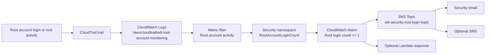

# Alert on AWS Root Account Login

Session 05 - Mastering AWS System Monitoring - TechX Training

The AWS root account is the most powerful identity in an AWS account. It can change account-level settings, close the account, manage billing, change root credentials, and perform actions that normal IAM users or roles may not be allowed to perform. Because of that, the root account should almost never be used for daily operations.

In a well-operated AWS environment, engineers use IAM users, IAM Identity Center, or IAM roles for normal work. The root account is reserved for a very small number of account recovery or account-level tasks. Therefore, a root account sign-in or root account activity should be treated as a security signal that needs immediate attention.

This lab builds that alerting path with CloudTrail, CloudWatch Logs, a metric filter, a CloudWatch alarm, and SNS notifications.

## Purpose of This Lab

The purpose of this lab is to alert the security team immediately when the AWS root account is used.

By the end of this lab, you will have:

- A CloudTrail trail sending management events to CloudWatch Logs.
- A CloudWatch Logs metric filter that detects root account activity.
- A custom CloudWatch metric in the `Security` namespace.
- A CloudWatch alarm that triggers when the root metric count is at least `1`.
- An SNS notification action that sends email and optionally SMS to the security team.

The final alert flow is:

```text
AWS root account login/activity
-> CloudTrail management event
-> CloudWatch Logs log group
-> Metric filter
-> Security/RootAccountLoginCount metric
-> CloudWatch Alarm
-> SNS email/SMS notification
```

## Reused Resources from Previous Labs

This lab continues the monitoring and alerting path from the previous sessions. Do not recreate resources that already exist and are still appropriate.

| Resource | Reuse guidance |
| --- | --- |
| SNS topic | You can reuse an existing confirmed SNS topic if it is acceptable for security alerts |
| Email subscription | You can reuse the confirmed email subscription from the CPU alarm lab |
| CloudWatch alarm workflow | The alarm creation pattern is the same as the CPU alarm lab |
| Monitoring Region | Use the Region where the CloudTrail trail sends events to CloudWatch Logs, for example `ap-southeast-1` |

If the previous SNS topic was only for CPU operations alerts, a separate security topic is cleaner. This README uses a dedicated topic name:

```text
w9-security-root-login-topic
```

## Target Architecture



## Detection Logic

The metric filter watches CloudTrail events and matches root account activity that is not an AWS service event.

Filter pattern:

```text
{ $.userIdentity.type = "Root" && $.eventType != "AwsServiceEvent" }
```

This means:

- `$.userIdentity.type = "Root"` detects events performed by the AWS account root user.
- `$.eventType != "AwsServiceEvent"` excludes events generated internally by AWS services.

The metric filter publishes one metric value whenever the pattern matches:

| Setting | Value |
| --- | --- |
| Filter name | `RootAccountLoginFilter` |
| Filter pattern | `{ $.userIdentity.type = "Root" && $.eventType != "AwsServiceEvent" }` |
| Metric namespace | `Security` |
| Metric name | `RootAccountLoginCount` |
| Metric value | `1` |

The alarm then watches the metric:

| Setting | Value |
| --- | --- |
| Namespace | `Security` |
| Metric | `RootAccountLoginCount` |
| Statistic | `Sum` |
| Period | `5 minutes` |
| Condition | `Greater than or equal to 1` |
| Evaluation periods | `1` |
| Datapoints to alarm | `1 out of 1` |
| Missing data treatment | `Treat missing data as not breaching` |

This is intentionally strict. Any single root login or root activity in a 5-minute period should put the alarm into `ALARM`.

## Important Safety Note

Do not use the root account casually just to create activity. If you test this lab with a real root login, keep it controlled:

- Use the root account only long enough to generate the CloudTrail event.
- Make sure root MFA is enabled.
- Do not create root access keys.
- Sign out immediately after the test.
- Review the alarm and CloudTrail event afterward.

In a production environment, use this alert as a detective control, not as permission to use root more often.

## Project Structure

```text
Alert-on-AWS-Root-Account-Login/
  README.md
  EVIDENCE.md
  docs/
    image/
      .gitkeep
```

Use `EVIDENCE.md` as the screenshot checklist and explanation file.

## Naming Convention

| Resource | Suggested name |
| --- | --- |
| CloudTrail trail | `w9-root-account-monitoring-trail` |
| CloudWatch Logs group | `/aws/cloudtrail/w9-root-account-monitoring` |
| CloudTrail delivery role | `CloudTrail_CloudWatchLogs_Role` |
| Metric filter | `RootAccountLoginFilter` |
| Metric namespace | `Security` |
| Metric name | `RootAccountLoginCount` |
| Alarm | `Security-RootAccount-Login-Detected` |
| SNS topic | `w9-security-root-login-topic` |

## Step 1 - Create or Update a CloudTrail Trail

CloudTrail records AWS account activity as events. For this lab, CloudTrail must send management events to a CloudWatch Logs log group, because the metric filter is created on CloudWatch Logs.

Open:

```text
CloudTrail -> Trails -> Create trail
```

Use:

```text
Trail name: w9-root-account-monitoring-trail
Apply trail to all Regions: Yes
Management events: Enabled
Read events: Enabled
Write events: Enabled
Data events: Not required for this lab
Insights events: Optional
```

For storage, CloudTrail also requires an S3 bucket for log file delivery. You can let the console create a new bucket, or select an existing CloudTrail bucket if your account already has one.

If you already have a trail, you do not need to create another one. Open the existing trail and make sure management events are enabled and CloudWatch Logs delivery is configured.

Evidence to capture:

- Trail exists.
- Multi-Region trail is enabled if selected.
- Management events are enabled.

## Step 2 - Send CloudTrail Events to CloudWatch Logs

Open the trail and edit the CloudWatch Logs section:

```text
CloudTrail -> Trails -> w9-root-account-monitoring-trail
CloudWatch Logs -> Edit
CloudWatch Logs: Enabled
```

Use a log group:

```text
Log group: /aws/cloudtrail/w9-root-account-monitoring
```

Use the default CloudTrail delivery role if the console offers it:

```text
CloudTrail_CloudWatchLogs_Role
```

CloudTrail needs this role so it can create log streams and put CloudTrail events into the CloudWatch Logs log group.

After saving, wait a few minutes. CloudTrail delivery to CloudWatch Logs is not instant. AWS documentation notes that delivery commonly takes several minutes, so a small delay is normal.

Evidence to capture:

- CloudWatch Logs delivery is enabled on the trail.
- Log group name is visible.
- Delivery role is visible.

## Step 3 - Confirm CloudTrail Events Arrive in CloudWatch Logs

Before creating a metric filter, confirm that events are actually arriving.

Open:

```text
CloudWatch -> Logs -> Log groups -> /aws/cloudtrail/w9-root-account-monitoring
```

Open the log stream and inspect recent events. CloudTrail events are JSON documents. You should see fields such as:

```text
eventTime
eventSource
eventName
awsRegion
userIdentity
```

This step prevents a common mistake: creating a metric filter on a log group that is not receiving events.

Evidence to capture:

- CloudTrail log group exists.
- Recent CloudTrail event is visible.

## Step 4 - Create the Root Account Metric Filter

Open the CloudTrail log group:

```text
CloudWatch -> Logs -> Log groups -> /aws/cloudtrail/w9-root-account-monitoring
Metric filters -> Create metric filter
```

Enter the filter pattern:

```text
{ $.userIdentity.type = "Root" && $.eventType != "AwsServiceEvent" }
```

Assign metric:

```text
Filter name: RootAccountLoginFilter
Metric namespace: Security
Metric name: RootAccountLoginCount
Metric value: 1
Default value: blank
Unit: Count
```

Leave default value blank. For security event filters, a missing event should mean no metric datapoint, not a zero datapoint from every log entry.

Evidence to capture:

- Filter pattern.
- Metric namespace `Security`.
- Metric name `RootAccountLoginCount`.
- Metric value `1`.

## Step 5 - Create the CloudWatch Alarm

After the metric filter is created, select it and create an alarm.

Alarm metric settings:

```text
Namespace: Security
Metric: RootAccountLoginCount
Statistic: Sum
Period: 5 minutes
```

Alarm condition:

```text
Threshold type: Static
Condition: Greater than or equal to 1
Evaluation periods: 1
Datapoints to alarm: 1 out of 1
Missing data treatment: Treat missing data as not breaching
```

Name:

```text
Security-RootAccount-Login-Detected
```

Description:

```text
Triggers when CloudTrail records root account activity that is not an AWS service event.
```

The alarm uses `Sum` because the metric filter emits `1` for every matching event. If the sum is at least `1` during a 5-minute period, root account activity occurred and the security team should be notified.

Evidence to capture:

- Alarm metric is `Security / RootAccountLoginCount`.
- Statistic is `Sum`.
- Threshold is `>= 1`.
- Period is `5 minutes`.

## Step 6 - Notify via SNS

Create or reuse an SNS topic for the security team.

Recommended dedicated topic:

```text
SNS -> Topics -> Create topic
Type: Standard
Name: w9-security-root-login-topic
```

Add email subscription:

```text
Protocol: Email
Endpoint: <security-team-email>
```

Optional SMS subscription:

```text
Protocol: SMS
Endpoint: +<country-code-and-phone-number>
```

Email subscriptions must be confirmed from the recipient inbox. SMS delivery may require account SMS settings, regional support, spend limits, or sandbox restrictions depending on the AWS account.

In the CloudWatch alarm action:

```text
Alarm state trigger: In alarm
Send notification to: w9-security-root-login-topic
```

Optional:

```text
OK state trigger: In OK
Send notification to: w9-security-root-login-topic
```

Evidence to capture:

- SNS topic.
- Confirmed email subscription.
- SMS subscription if used.
- Alarm action points to the SNS topic.

## Step 7 - Test or Validate the Detection

The cleanest real test is a controlled root console sign-in, but only do this if your instructor or security process allows it.

If testing with root sign-in:

1. Make sure root MFA is enabled.
2. Sign in as root.
3. Do not change resources.
4. Sign out immediately.
5. Wait for CloudTrail delivery to CloudWatch Logs.
6. Watch the metric and alarm.

Expected CloudTrail event:

```text
eventName: ConsoleLogin
userIdentity.type: Root
eventType: AwsConsoleSignIn
```

Expected alarm behavior:

```text
Security/RootAccountLoginCount >= 1
Alarm state: ALARM
SNS notification sent
```

If you are not allowed to sign in as root for testing, document the configuration evidence instead: metric filter pattern, alarm settings, and SNS action. This still proves the detection control is configured.

Evidence to capture:

- CloudTrail event with `userIdentity.type = Root`, if testing is allowed.
- Metric graph for `Security / RootAccountLoginCount`.
- Alarm entered `ALARM`.
- Email/SMS notification received.

## Step 8 - Optional Lambda Response

The lab mentions an optional Lambda action to auto-disable root credentials. Be careful with this wording: AWS root credentials cannot be handled like normal IAM user credentials in every case, and automated root response must be designed very carefully.

For a safe training lab, treat Lambda response as optional design documentation. A practical response Lambda might:

- Create a high-priority incident ticket.
- Notify Slack or a security webhook.
- Query CloudTrail for root event context.
- Notify account owners.

Do not build destructive automation for the root account unless it has been reviewed and approved.

## Troubleshooting

If the metric filter never emits data, confirm that CloudTrail events are reaching the CloudWatch Logs log group. The filter only works on log events that exist in that log group.

If the root login appears in CloudTrail Event history but not CloudWatch Logs, check that the trail is configured to send management events to the CloudWatch Logs log group.

If the alarm remains `INSUFFICIENT_DATA`, remember that no root event means no metric datapoint. With missing data treated as not breaching, this is expected until a matching event occurs.

If SNS email does not arrive, check that the email subscription is `Confirmed`.

If SMS does not arrive, check SMS settings and account restrictions. SMS is optional for this lab.

## Cleanup

If this is only a lab, clean up the resources after evidence is captured:

```text
CloudWatch -> Alarms -> Security-RootAccount-Login-Detected -> Delete
CloudWatch Logs -> Log groups -> /aws/cloudtrail/w9-root-account-monitoring -> Delete if no longer needed
CloudTrail -> Trails -> w9-root-account-monitoring-trail -> Delete if this was only a lab trail
SNS -> Topics -> w9-security-root-login-topic -> Delete if no longer needed
```

Do not delete an organization or production CloudTrail trail just because the lab is complete. If an existing security trail was reused, keep it.

## References

- AWS CloudTrail - Sending events to CloudWatch Logs: https://docs.aws.amazon.com/awscloudtrail/latest/userguide/send-cloudtrail-events-to-cloudwatch-logs.html
- AWS CloudTrail - Creating CloudWatch alarms for CloudTrail events: https://docs.aws.amazon.com/awscloudtrail/latest/userguide/cloudwatch-alarms-for-cloudtrail.html
- AWS CloudWatch Logs - Filter and pattern syntax: https://docs.aws.amazon.com/AmazonCloudWatch/latest/logs/FilterAndPatternSyntax.html
- AWS SNS - Email notifications: https://docs.aws.amazon.com/sns/latest/dg/sns-email-notifications.html
