# Evidence W9 - GitOps, Observability, Canary


```text
cloud/w9/project-01-gitops-observability-canary/docs/image/
```

## 1. Tóm Tắt Kết Quả

Project này chứng minh một pipeline vận hành an toàn theo mô hình:

```text
Git change
-> GitHub Actions validate
-> ArgoCD sync desired state
-> w9-api chạy bằng Argo Rollouts
-> Prometheus scrape /metrics
-> SLO đánh giá chất lượng request
-> AnalysisTemplate quyết định canary
-> Alertmanager gửi email khi SLO tụt
-> git revert rollback khi cần quay về bản tốt
```

Kết quả cuối cùng cần chứng minh:

- Mọi thay đổi đều đi qua Git, không sửa workload trực tiếp bằng `kubectl edit` hay `kubectl set image`.
- ArgoCD quản lý cluster bằng app-of-apps, có self-heal khi cluster bị drift.
- Prometheus đo được metric thật từ app và tính SLO success rate.
- Alert `W9ApiHighErrorRate` fire khi inject lỗi và gửi được email cá nhân.
- Canary lỗi bị `AnalysisTemplate` đánh fail và Argo Rollouts tự abort về bản stable.
- Rollback bằng `git revert` hoàn tất trong dưới 5 phút.

## 2. Danh Sách Ảnh Nộp

Tổng cộng 32 ảnh, sắp xếp theo đúng thứ tự thực hành từ buổi sáng sang buổi chiều.

| STT | File ảnh | Nội dung evidence |
| --- | --- | --- |
| 01 | `docs/image/01-tools-cluster-ready.png` | Môi trường local và cụm `w9` đã sẵn sàng |
| 02 | `docs/image/02-repo-project-structure.png` | Repo có đủ source app, manifest, ArgoCD apps và workflow |
| 03 | `docs/image/03-app-image-built.png` | Image stable `w9-api:3` đã được build vào minikube |
| 04 | `docs/image/04-kustomize-render.png` | Kustomize render được toàn bộ desired state |
| 05 | `docs/image/05-argocd-installed.png` | ArgoCD đã được cài và chạy trong cluster |
| 06 | `docs/image/06-app-of-apps-root.png` | Root app `w9-app-of-apps` quản lý thư mục child apps |
| 07 | `docs/image/07-child-apps-synced-healthy.png` | Các child apps đều `Synced/Healthy` |
| 08 | `docs/image/08-sync-waves-addons-before-app.png` | Sync waves đảm bảo add-ons cài trước workload |
| 09 | `docs/image/09-w9-api-running-from-git.png` | `w9-api` chạy từ desired state trên Git |
| 10 | `docs/image/10-ci-workflows-present.png` | Workflow CI/CD W9 tồn tại trong repo |
| 11 | `docs/image/11-ci-actions-pass.png` | GitHub Actions pass, chỉ validate chứ không deploy trực tiếp |
| 12 | `docs/image/12-no-drift-self-heal.png` | ArgoCD self-heal khi cluster bị drift |
| 13 | `docs/image/13-gitops-baseline-summary.png` | Baseline GitOps healthy trước khi sang observability |
| 14 | `docs/image/14-observability-stack-running.png` | Prometheus/Grafana/Operator và Argo Rollouts controller running |
| 15 | `docs/image/15-metrics-endpoint.png` | App expose `/metrics` có metric Flask request |
| 16 | `docs/image/16-prometheus-target-up.png` | Prometheus scrape target `w9-api` ở trạng thái `UP` |
| 17 | `docs/image/17-grafana-query.png` | Grafana query được dữ liệu từ Prometheus |
| 18 | `docs/image/18-slo-rule-resource.png` | `PrometheusRule` chứa SLO recording rule và alert rule |
| 19 | `docs/image/19-slo-query-success-rate.png` | Query SLO trả giá trị healthy gần `1` |
| 20 | `docs/image/20-alertmanager-email-config.png` | Alertmanager email receiver được cấu hình, secret tách khỏi Git |
| 21 | `docs/image/21-rollout-strategy-analysis-template.png` | Rollout có canary strategy và AnalysisTemplate |
| 22 | `docs/image/22-good-version-v3-healthy.png` | Version stable `v3` healthy trước khi inject lỗi |
| 23 | `docs/image/23-bad-canary-git-commit.png` | Commit Git đổi desired state sang bad canary `v4` |
| 24 | `docs/image/24-actions-pass-after-bad-change.png` | CI pass sau bad canary commit vì manifest hợp lệ |
| 25 | `docs/image/25-canary-traffic-errors.png` | Traffic tạo lỗi 500 từ canary `v4` |
| 26 | `docs/image/26-analysisrun-failed.png` | AnalysisRun fail do success rate dưới ngưỡng |
| 27 | `docs/image/27-rollout-auto-aborted.png` | Rollout auto-abort, bản stable cũ vẫn available |
| 28 | `docs/image/28-alert-firing.png` | Alert `W9ApiHighErrorRate` ở trạng thái `Firing` |
| 29 | `docs/image/29-alert-email-received.png` | Email cá nhân nhận được alert |
| 30 | `docs/image/30-git-revert-rollback-time.png` | Rollback bằng `git revert` dưới 300 giây |
| 31 | `docs/image/31-final-healthy.png` | Hệ thống healthy sau rollback |
| 32 | `docs/image/32-cleanup-secret-placeholder.png` | Secret đã xóa và cấu hình nhạy cảm được reset |

### 2.1. Ảnh Đã Cập Nhật Tạm Thời Trong Repo

Các ảnh dưới đây là những file evidence hiện đã có thật trong thư mục `docs/image/` và đã được nhúng trực tiếp vào file này để mentor có thể xem ngay trong Markdown.

#### 04. Kustomize Render Được Desired State

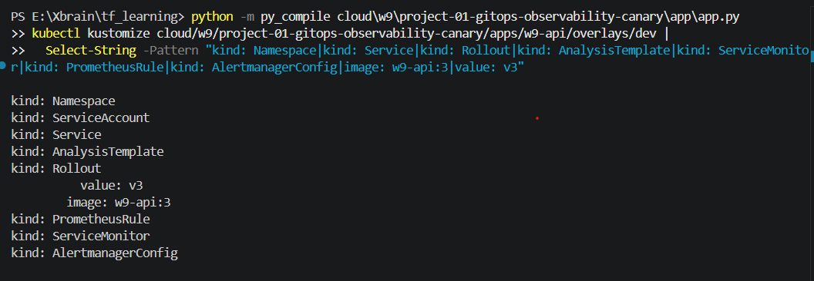

#### 05. ArgoCD Đã Cài Và Running

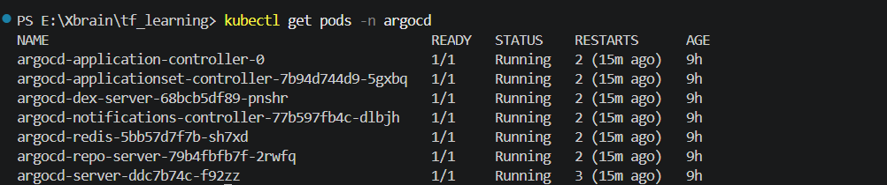

#### 07. Child Apps Synced/Healthy

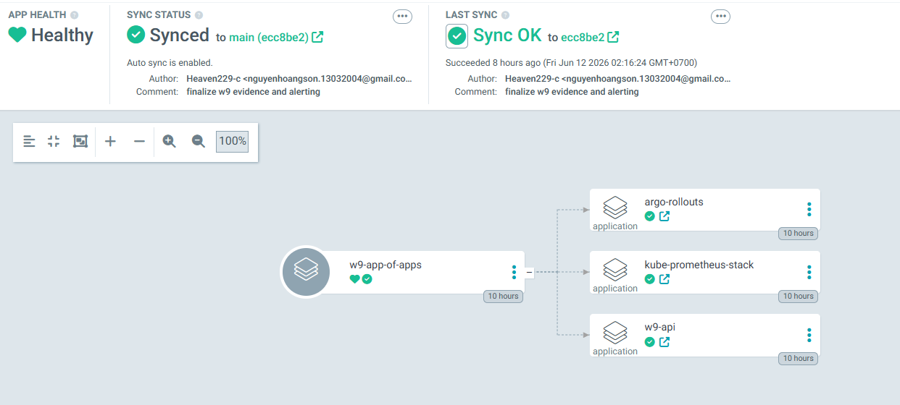

#### 08. Sync Waves Add-ons Trước Workload

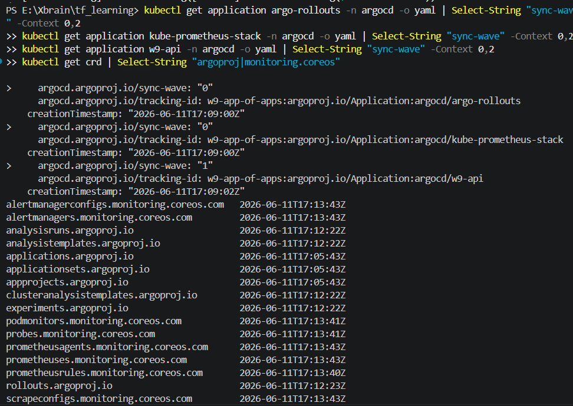

#### 09. W9 API Chạy Từ Git

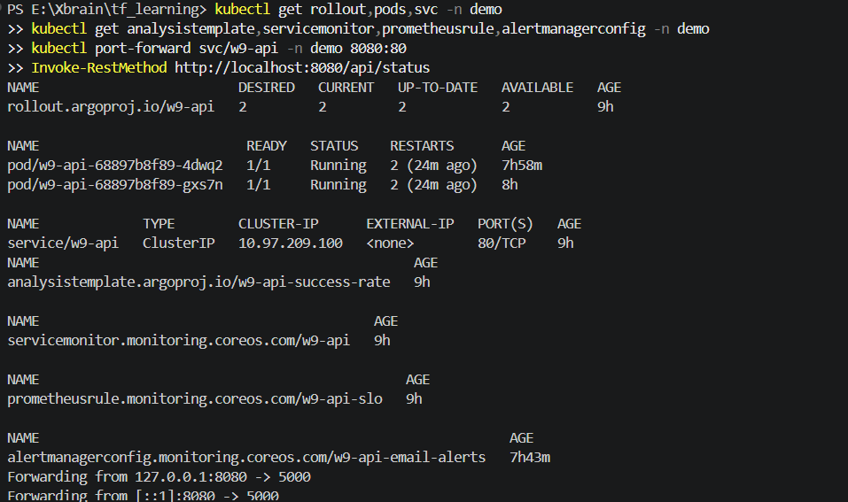

#### 10. Workflow CI/CD Có Trong Repo

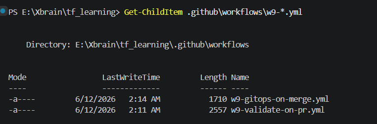

#### 11. GitHub Actions Pass

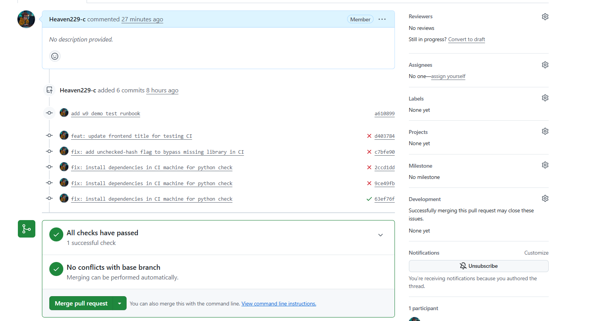

#### 12. ArgoCD Self-Heal Drift

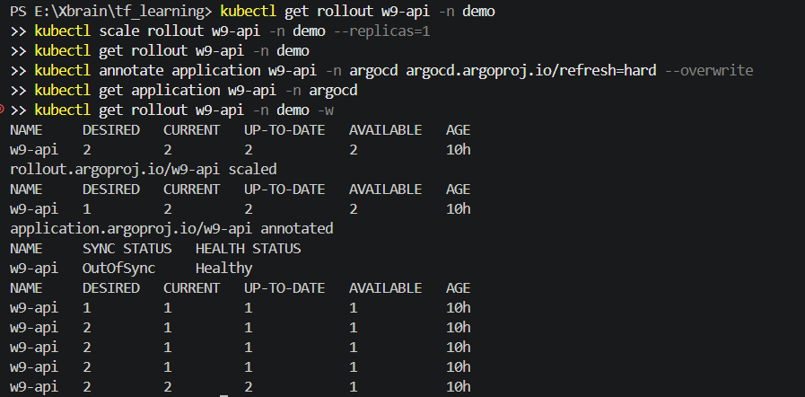

#### 13. Baseline GitOps Healthy

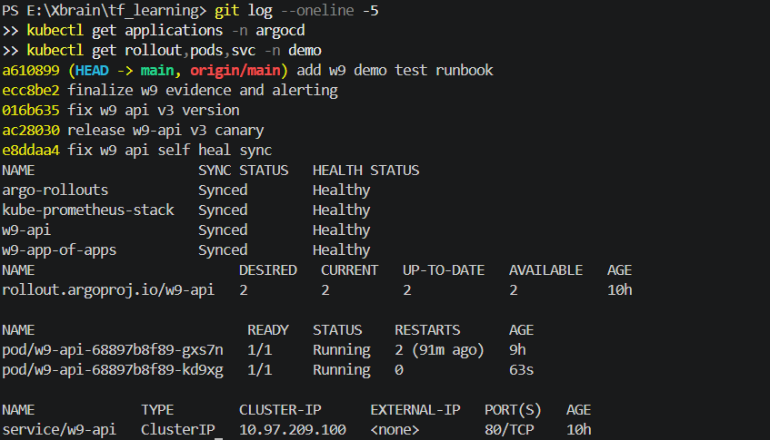

#### 14. Observability Stack Running

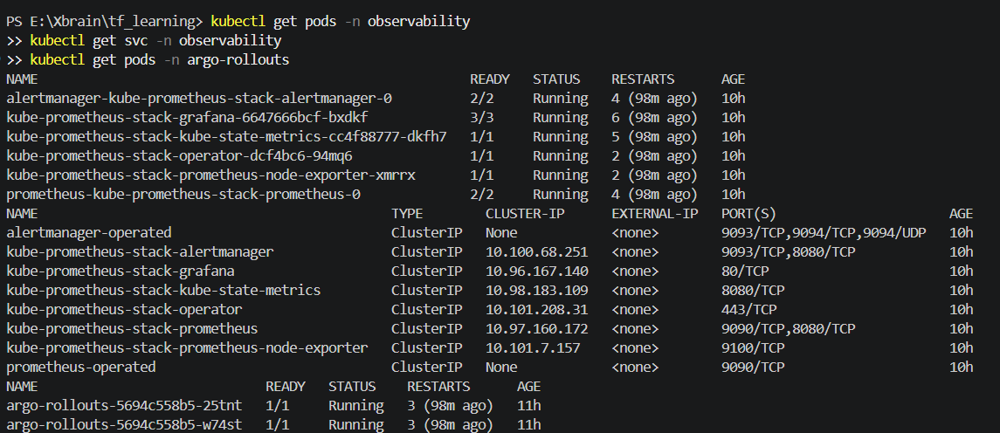

#### 15. App Expose Endpoint Metrics

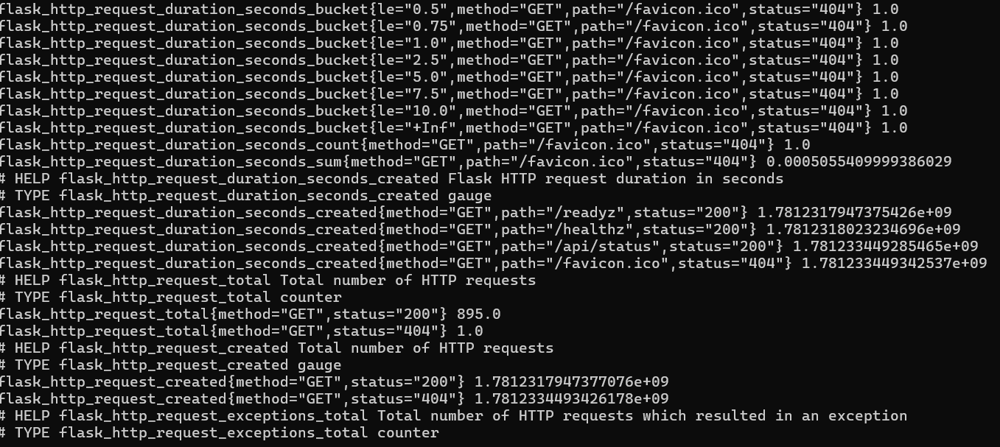

#### 16. Prometheus Target UP

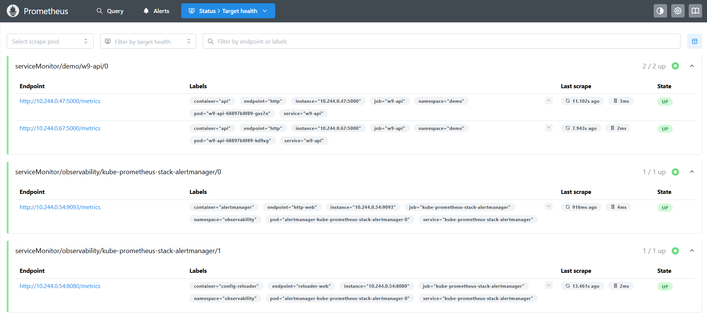

#### 17. Grafana Query Được Metric

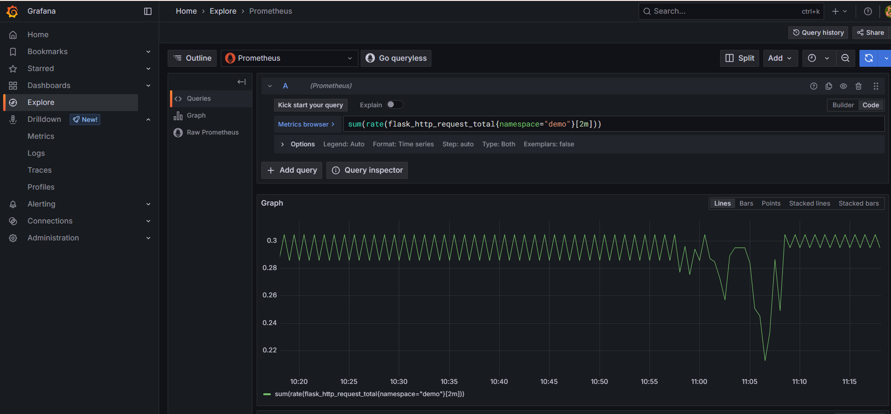

#### 18. PrometheusRule Cho SLO Và Alert

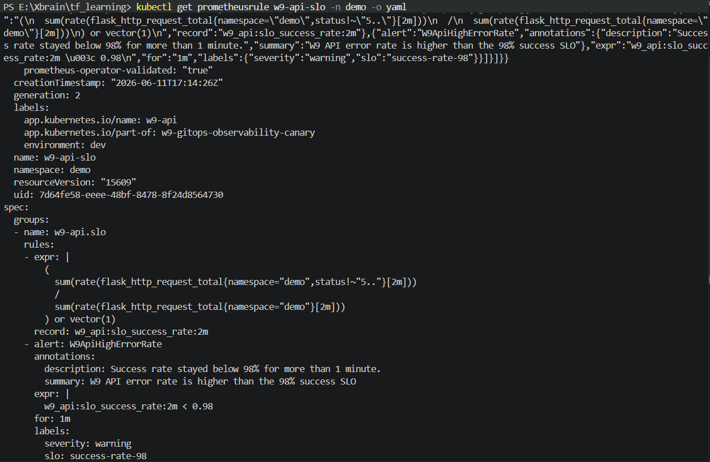

#### 19. Query SLO Success Rate Healthy

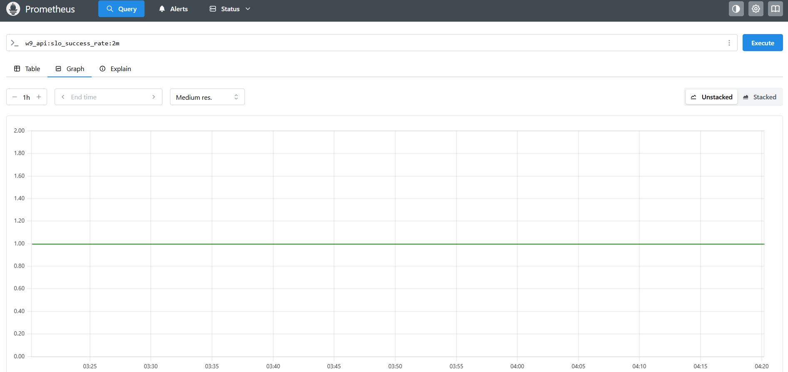

#### 21. Rollout Strategy Và AnalysisTemplate

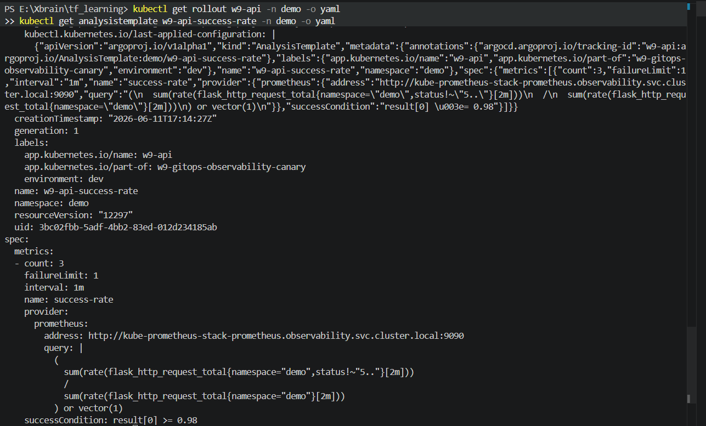

#### 22. Stable Version V3 Healthy

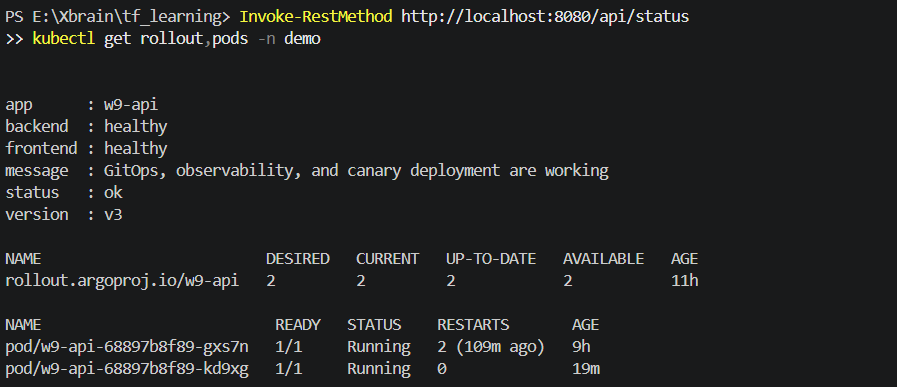

#### 23. Bad Canary Commit Đi Qua Git

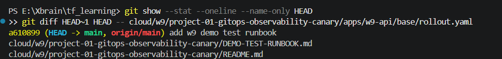

### 2.2. Ảnh Còn Cần Bổ Sung Sau

Hiện tại repo chưa có file ảnh cho các mốc sau: `01`, `02`, `03`, `06`, `20`, `24`, `25`, `26`, `27`, `28`, `29`, `30`, `31`, `32`. Khi chụp bổ sung, chỉ cần lưu đúng tên file trong bảng ở mục 2, các đường dẫn evidence sẽ khớp ngay với lộ trình thực hành.

## 3. Kiến Trúc Evidence

```mermaid
flowchart LR
  Dev[Developer] --> Git[Git commit / push]
  Git --> CI[GitHub Actions validate]
  Git --> ArgoCD[ArgoCD app-of-apps]
  ArgoCD --> Addons[Argo Rollouts + Prometheus Stack]
  ArgoCD --> App[w9-api Rollout]
  App --> Metrics[/metrics]
  Metrics --> Prometheus[Prometheus]
  Prometheus --> SLO[PrometheusRule SLO]
  SLO --> Alert[Alertmanager email]
  Prometheus --> Analysis[AnalysisTemplate]
  Analysis -->|metric tốt| Promote[Canary tiếp tục]
  Analysis -->|metric xấu| Abort[Auto-abort về bản stable]
```

## 4. GitOps Và CI/CD

### 4.1. Môi Trường Và Cụm W9 Sẵn Sàng

### 4.3. Image Stable Đã Có Trong Minikube

Ảnh cần nộp: `docs/image/03-app-image-built.png`

Lệnh:

```powershell
Set-Location E:\Xbrain\tf_learning\cloud\w9\project-01-gitops-observability-canary
minikube image build -p w9 -t w9-api:3 app
minikube image ls -p w9 | Select-String "w9-api"
Set-Location E:\Xbrain\tf_learning
```

Vì lab chạy local bằng minikube nên image không cần push lên Docker Hub hay ECR. Ảnh này chứng minh image `w9-api:3` đã được nạp vào đúng minikube profile `w9`, trùng với image stable trong manifest. Nhờ vậy khi ArgoCD sync rollout, pod có thể chạy bằng local image thay vì bị `ImagePullBackOff`.

### 4.4. Manifest Render Được Trước Khi Sync

Ảnh cần nộp: `docs/image/04-kustomize-render.png`

Lệnh dùng để chụp:

```powershell
python -m py_compile cloud\w9\project-01-gitops-observability-canary\app\app.py
kubectl kustomize cloud/w9/project-01-gitops-observability-canary/apps/w9-api/overlays/dev |
  Select-String -Pattern "kind: Namespace|kind: Service|kind: Rollout|kind: AnalysisTemplate|kind: ServiceMonitor|kind: PrometheusRule|kind: AlertmanagerConfig|image: w9-api:3|value: v3"
```

Diễn giải evidence:

Ảnh này cho thấy source Python không lỗi cú pháp và overlay Kustomize render được đầy đủ resource cần thiết. Điểm quan trọng là workload dùng `kind: Rollout`, có `AnalysisTemplate`, `ServiceMonitor`, `PrometheusRule` và `AlertmanagerConfig`. Như vậy desired state trong Git đã sẵn sàng để ArgoCD kéo vào cluster.

### 4.5. ArgoCD Đã Được Cài Trong Cluster

Ảnh cần nộp: `docs/image/05-argocd-installed.png`

Lệnh dùng để chụp:

```powershell
#kubectl create namespace argocd --dry-run=client -o yaml | kubectl apply -f -
#helm repo add argo https://argoproj.github.io/argo-helm --force-update
#helm repo update
#helm upgrade --install argocd argo/argo-cd -n argocd
#kubectl rollout status deployment/argocd-server -n argocd --timeout=300s
kubectl get pods -n argocd
```

Diễn giải evidence:

Ảnh này chứng minh ArgoCD đã chạy bên trong cluster, không phải một tool chạy tạm trên máy local. Từ thời điểm này, ArgoCD có thể liên tục so sánh trạng thái thật của cluster với desired state trong Git và tự động sync/self-heal khi có lệch.

### 4.6. Root App Theo Mô Hình App-Of-Apps

Ảnh cần nộp: `docs/image/06-app-of-apps-root.png`

Lệnh dùng để chụp:

```powershell
kubectl apply -f cloud/w9/project-01-gitops-observability-canary/argocd/app-of-apps.yaml
kubectl get application w9-app-of-apps -n argocd -o yaml
```

Diễn giải evidence:

Ảnh này chứng minh bài dùng mô hình app-of-apps. Root app `w9-app-of-apps` trỏ tới thư mục `argocd/apps`, nơi chứa các child Application như Argo Rollouts, kube-prometheus-stack và `w9-api`. Đây là bước chuyển từ việc apply từng app bằng tay sang việc để một root app quản lý toàn bộ hệ thống.

### 4.7. Child Apps Đều Synced/Healthy

Ảnh cần nộp: `docs/image/07-child-apps-synced-healthy.png`

Lệnh hoặc UI dùng để chụp:

```powershell
kubectl get applications -n argocd
```

Hoặc ArgoCD UI:

```text
https://localhost:8081
```

Diễn giải evidence:

Ảnh này là bằng chứng GitOps loop đã hoạt động. `w9-app-of-apps` là root app, còn `argo-rollouts`, `kube-prometheus-stack` và `w9-api` là child apps. Khi tất cả đều `Synced/Healthy`, điều đó nghĩa là ArgoCD đã đọc manifest từ Git và cluster đang khớp với desired state.

### 4.8. Sync Waves Đúng Thứ Tự

Ảnh cần nộp: `docs/image/08-sync-waves-addons-before-app.png`

Lệnh dùng để chụp:

```powershell
kubectl get application argo-rollouts -n argocd -o yaml | Select-String "sync-wave" -Context 0,2
kubectl get application kube-prometheus-stack -n argocd -o yaml | Select-String "sync-wave" -Context 0,2
kubectl get application w9-api -n argocd -o yaml | Select-String "sync-wave" -Context 0,2
kubectl get crd | Select-String "argoproj|monitoring.coreos"
```

Diễn giải evidence:

Ảnh này giải thích vì sao app không bị lỗi thiếu CRD. Argo Rollouts và kube-prometheus-stack được đặt ở wave `0` để cài CRD trước, còn `w9-api` ở wave `1` vì phụ thuộc vào `Rollout`, `AnalysisTemplate`, `ServiceMonitor` và `PrometheusRule`. Đây chính là ý trong deck về sync waves: nền tảng phải đi trước workload.

### 4.9. Ứng Dụng Chạy Từ Desired State Trên Git

Ảnh cần nộp: `docs/image/09-w9-api-running-from-git.png`

Lệnh dùng để chụp:

```powershell
kubectl get rollout,pods,svc -n demo
kubectl get analysistemplate,servicemonitor,prometheusrule,alertmanagerconfig -n demo
kubectl port-forward svc/w9-api -n demo 8080:80
Invoke-RestMethod http://localhost:8080/api/status
```

Diễn giải evidence:

Ảnh này chứng minh `w9-api` đã được deploy bởi ArgoCD từ Git. Namespace `demo` có rollout, pod, service và các resource observability liên quan. API trả `version: v3`, `status: ok`, tức bản stable ban đầu đang hoạt động. Đây là baseline trước khi đi sang observability và canary.

### 4.10. Workflow CI/CD Có Trong Repo

Ảnh cần nộp: `docs/image/10-ci-workflows-present.png`

Lệnh dùng để chụp:

```powershell
Get-ChildItem .github\workflows\w9-*.yml
Get-Content .github\workflows\w9-validate-on-pr.yml
Get-Content .github\workflows\w9-gitops-on-merge.yml
```

Diễn giải evidence:

Ảnh này chứng minh repo có guardrails cho GitOps. Workflow PR dùng để validate source và manifest trước khi merge. Workflow sau merge xác nhận manifest vẫn render được. Quan trọng là workflow không trực tiếp deploy cluster; việc sync cluster là trách nhiệm của ArgoCD.

### 4.11. GitHub Actions Pass

Ảnh cần nộp: `docs/image/11-ci-actions-pass.png`

Màn hình dùng để chụp:

```text
GitHub repo -> Actions -> workflow W9 pass
```

Diễn giải evidence:

Ảnh này cho thấy CI đã kiểm tra thành công code và manifest. Điều này chứng minh thay đổi trước khi vào `main` đã qua bước gác cổng. Trong GitOps, CI không cần kubeconfig và không apply trực tiếp; nó chỉ đảm bảo desired state đủ hợp lệ để ArgoCD sync.

### 4.12. ArgoCD Self-Heal Khi Có Drift

Ảnh cần nộp: `docs/image/12-no-drift-self-heal.png`

Lệnh dùng để chụp:

```powershell
kubectl get rollout w9-api -n demo
kubectl scale rollout w9-api -n demo --replicas=1
kubectl get rollout w9-api -n demo
kubectl annotate application w9-api -n argocd argocd.argoproj.io/refresh=hard --overwrite
kubectl get application w9-api -n argocd
kubectl get rollout w9-api -n demo
```

Diễn giải evidence:

Ảnh này chứng minh nguyên tắc reconciled trong GitOps. Em cố tình scale trực tiếp rollout xuống `1`, tạo trạng thái lệch Git. Sau khi ArgoCD refresh, rollout quay lại desired state `replicas: 2`. Điều đó cho thấy sửa tay trên cluster không tồn tại lâu, vì ArgoCD luôn đưa cluster về đúng Git.

### 4.13. Baseline GitOps Trước Khi Sang Buổi Chiều

Ảnh cần nộp: `docs/image/13-gitops-baseline-summary.png`

Lệnh dùng để chụp:

```powershell
git log --oneline -5
kubectl get applications -n argocd
kubectl get rollout,pods,svc -n demo
```

Diễn giải evidence:

Ảnh này là điểm chốt của buổi sáng. Git history rõ ràng, ArgoCD apps healthy và `w9-api` đang chạy ổn định. Từ đây có thể tiếp tục buổi chiều: thêm observability, SLO, alert và canary analysis trên một nền GitOps đã đúng.

## 5. Buổi Chiều - Observability

### 5.1. Observability Stack Và Argo Rollouts Running

Ảnh cần nộp: `docs/image/14-observability-stack-running.png`

Lệnh dùng để chụp:

```powershell
kubectl get pods -n observability
kubectl get svc -n observability
kubectl get pods -n argo-rollouts
```

Diễn giải evidence:

Ảnh này chứng minh nền tảng buổi chiều đã được cài qua GitOps. Namespace `observability` có Prometheus, Grafana và operator; namespace `argo-rollouts` có controller để điều khiển rollout canary. Đây là phần nối giữa GitOps foundation và progressive delivery.

### 5.2. App Có Endpoint Metrics

Ảnh cần nộp: `docs/image/15-metrics-endpoint.png`

Lệnh dùng để chụp:

```powershell
kubectl port-forward svc/w9-api -n demo 8080:80
Invoke-WebRequest http://localhost:8080/metrics |
  Select-Object -ExpandProperty Content |
  Select-String "flask_http_request_total"
```

Diễn giải evidence:

Ảnh này cho thấy app không chỉ có health check mà còn expose metric thật ở `/metrics`. Metric `flask_http_request_total` là dữ liệu nền để tính request rate, error rate và success rate. Không có metric này thì Prometheus không thể đánh giá SLO, và Argo Rollouts cũng không có cơ sở để auto-abort.

### 5.3. Prometheus Target UP

Ảnh cần nộp: `docs/image/16-prometheus-target-up.png`

Lệnh/UI dùng để chụp:

```powershell
kubectl port-forward svc/kube-prometheus-stack-prometheus -n observability 9090:9090
```

Mở:

```text
http://localhost:9090/targets
```

Diễn giải evidence:

Ảnh này chứng minh Prometheus đã phát hiện và scrape được target của `w9-api` thông qua `ServiceMonitor`. Trạng thái `UP` nghĩa là Prometheus gọi được endpoint `/metrics` đều đặn, nên các query SLO phía sau có dữ liệu thật chứ không phải cấu hình treo.

### 5.4. Grafana Đọc Được Prometheus

Ảnh cần nộp: `docs/image/17-grafana-query.png`

Lệnh/UI dùng để chụp:

```powershell
kubectl port-forward svc/kube-prometheus-stack-grafana -n observability 3000:80
```

Mở:

```text
http://localhost:3000
username: admin
password: admin
```

Query trong Grafana Explore:

```promql
sum(rate(flask_http_request_total{namespace="demo"}[2m]))
```

Diễn giải evidence:

Ảnh này chứng minh Grafana đã kết nối được Prometheus datasource và query được metric của app. Grafana là lớp hiển thị để người vận hành quan sát hệ thống, còn Prometheus là nơi lưu metric và đánh giá rule.

### 5.5. SLO Rule Được Quản Lý Bằng Git

Ảnh cần nộp: `docs/image/18-slo-rule-resource.png`

Lệnh dùng để chụp:

```powershell
kubectl get prometheusrule w9-api-slo -n demo -o yaml
```

Diễn giải evidence:

Ảnh này chứng minh SLO không phải query thủ công trong UI mà là `PrometheusRule` được quản lý bằng manifest. Rule tạo recording metric `w9_api:slo_success_rate:2m`, đồng thời định nghĩa alert `W9ApiHighErrorRate` khi success rate dưới `0.98` trong `1m`. Đây là bằng chứng SLO/alert nằm trong Git và đi cùng workload.

### 5.6. SLO Query Trả Value Healthy

Ảnh cần nộp: `docs/image/19-slo-query-success-rate.png`

Query trong Prometheus:

```promql
w9_api:slo_success_rate:2m
```

Diễn giải evidence:

Ảnh này cho thấy SLO query đã hoạt động và trả value gần `1` khi hệ thống healthy. Success rate được tính từ tỷ lệ request không phải 5xx trên tổng request. Với project này, ngưỡng đạt là `0.98`, tức tối thiểu 98% request thành công. Metric này sẽ được dùng chung cho alert và canary analysis.

### 5.7. Alertmanager Có Đường Gửi Email

Ảnh cần nộp: `docs/image/20-alertmanager-email-config.png`

Lệnh dùng để chụp:

```powershell
kubectl get alertmanagerconfig w9-api-email-alerts -n demo -o yaml
kubectl get secret alertmanager-smtp-auth -n demo
kubectl get alertmanager kube-prometheus-stack-alertmanager -n observability -o yaml |
  Select-String -Pattern "alertmanagerConfigSelector|alertmanagerConfigNamespaceSelector" -Context 0,3
```

Diễn giải evidence:

Ảnh này chứng minh alert có receiver email, nhưng SMTP password không bị commit vào Git. Email route nằm trong `AlertmanagerConfig`, còn password nằm trong Kubernetes Secret `alertmanager-smtp-auth`. Việc Alertmanager có selector đọc config cross-namespace cho thấy alert của namespace `demo` có thể được Alertmanager trong namespace `observability` xử lý.

## 6. Buổi Chiều - Canary Và Challenge Ship Smartly

### 6.1. Rollout Có Canary Strategy Và AnalysisTemplate

Ảnh cần nộp: `docs/image/21-rollout-strategy-analysis-template.png`

Lệnh dùng để chụp:

```powershell
kubectl get rollout w9-api -n demo -o yaml
kubectl get analysistemplate w9-api-success-rate -n demo -o yaml
```

Diễn giải evidence:

Ảnh này chứng minh `w9-api` không dùng Deployment thường mà dùng Argo Rollouts. Rollout có các bước canary như `setWeight`, `pause`, `analysis`; `AnalysisTemplate` query Prometheus và yêu cầu `result[0] >= 0.98`. Đây là cơ chế để máy tự chấm canary khỏe hay bệnh.

### 6.2. Baseline Stable V3 Healthy

Ảnh cần nộp: `docs/image/22-good-version-v3-healthy.png`

Lệnh dùng để chụp:

```powershell
kubectl port-forward svc/w9-api -n demo 8080:80
Invoke-RestMethod http://localhost:8080/api/status
kubectl get rollout,pods -n demo
```

Diễn giải evidence:

Ảnh này xác nhận trước khi inject lỗi, hệ thống đang ở bản stable `v3` và API trả `status: ok`. Đây là mốc so sánh quan trọng: sau khi bad canary bị abort hoặc rollback, hệ thống phải quay về trạng thái tốt này.

### 6.3. Bad Canary Đi Qua Git

Ảnh cần nộp: `docs/image/23-bad-canary-git-commit.png`

Lệnh dùng để chụp:

```powershell
git show --stat --oneline --name-only HEAD
git diff HEAD~1 HEAD -- cloud/w9/project-01-gitops-observability-canary/apps/w9-api/base/rollout.yaml
```

Diễn giải evidence:

Ảnh này chứng minh bản lỗi được tạo đúng theo GitOps: đổi manifest trong Git rồi push, không sửa trực tiếp trên cluster. Commit chuyển image sang `w9-api:4`, đổi `APP_VERSION` thành `v4` và đặt `FAIL_RATE="1"` để mọi request vào canary có thể tạo lỗi 500. Đây là cách inject lỗi có kiểm soát để kiểm tra auto-abort.

### 6.4. CI Pass Sau Bad Change

Ảnh cần nộp: `docs/image/24-actions-pass-after-bad-change.png`

Màn hình dùng để chụp:

```text
GitHub Actions -> workflow W9 pass sau bad canary commit
```

Diễn giải evidence:

Ảnh này giải thích ranh giới giữa CI và observability. CI pass vì YAML và Kustomize manifest vẫn hợp lệ; CI không thể biết logic runtime của `v4` sẽ trả lỗi. Lỗi runtime sẽ được phát hiện ở bước sau bằng Prometheus metric và `AnalysisTemplate`.

### 6.5. Traffic Tạo Lỗi 500 Trong Canary

Ảnh cần nộp: `docs/image/25-canary-traffic-errors.png`

Lệnh dùng để chụp:

```powershell
1..1200 | ForEach-Object {
  try {
    $Response = Invoke-RestMethod http://localhost:8080/api/status
    Write-Host "ok version=$($Response.version)"
  } catch {
    Write-Host "expected 500 from bad canary"
  }
  Start-Sleep -Milliseconds 150
}
```

Diễn giải evidence:

Ảnh này chứng minh bản canary `v4` tạo lỗi thật dưới traffic. Các dòng `expected 500 from bad canary` làm cho Prometheus ghi nhận request 5xx, từ đó success rate tụt xuống dưới ngưỡng. Đây là bước kích hoạt dữ liệu để `AnalysisRun` có cơ sở đánh fail.

### 6.6. AnalysisRun Failed

Ảnh cần nộp: `docs/image/26-analysisrun-failed.png`

Lệnh dùng để chụp:

```powershell
kubectl get analysisrun -n demo
kubectl describe analysisrun -n demo
```

Diễn giải evidence:

Ảnh này là bằng chứng chính của auto-analysis. `AnalysisRun` được tạo trong quá trình canary, metric `success-rate` query Prometheus và fail vì kết quả thấp hơn `0.98`. Điều này chứng minh rollout không phụ thuộc vào người ngồi nhìn dashboard; nó dùng metric thật để quyết định.

### 6.7. Rollout Auto-Aborted

Ảnh cần nộp: `docs/image/27-rollout-auto-aborted.png`

Lệnh dùng để chụp:

```powershell
kubectl get rollout w9-api -n demo
kubectl describe rollout w9-api -n demo
kubectl get pods -n demo
Invoke-RestMethod http://localhost:8080/api/status
```

Diễn giải evidence:

Ảnh này chứng minh Argo Rollouts đã tự abort bản lỗi. Bản `v4` không được promote lên 100%; stable pods của bản cũ vẫn available và API sau abort quay về `version: v3`, `status: ok`. Đây là tiêu chí quan trọng nhất của challenge: bad canary tự động bị chặn trước khi trở thành version chính.

### 6.8. Alert Firing Khi SLO Tụt

Ảnh cần nộp: `docs/image/28-alert-firing.png`

Lệnh/UI dùng để chụp:

```powershell
Invoke-RestMethod "http://localhost:9090/api/v1/query?query=ALERTS%7Balertname%3D%22W9ApiHighErrorRate%22%7D" |
  ConvertTo-Json -Depth 10
```

Hoặc Alertmanager UI:

```text
http://localhost:9093
```

Diễn giải evidence:

Ảnh này chứng minh SLO không chỉ dùng để xem dashboard mà còn tạo cảnh báo vận hành. Khi traffic lỗi kéo success rate xuống dưới 98%, alert `W9ApiHighErrorRate` chuyển sang `Firing`. Đây là phần nối giữa observability và vận hành thực tế.

### 6.9. Email Cá Nhân Nhận Alert

Ảnh cần nộp: `docs/image/29-alert-email-received.png`

Diễn giải evidence:

Ảnh này chứng minh luồng cảnh báo đi end-to-end: `PrometheusRule` tạo alert, Alertmanager nhận alert, `AlertmanagerConfig` route alert tới email cá nhân. Khi nộp ảnh, em che thông tin riêng tư và chỉ để lại phần đủ chứng minh alert name hoặc nội dung cảnh báo liên quan `W9ApiHighErrorRate`.

### 6.10. Rollback Bằng Git Revert Dưới 5 Phút

Ảnh cần nộp: `docs/image/30-git-revert-rollback-time.png`

Lệnh dùng để chụp:

```powershell
$Start = Get-Date
git revert --no-edit HEAD
git push origin main
kubectl annotate application w9-api -n argocd argocd.argoproj.io/refresh=hard --overwrite

do {
  Start-Sleep -Seconds 10
  $Sync = kubectl get application w9-api -n argocd -o jsonpath='{.status.sync.status}'
  $Health = kubectl get application w9-api -n argocd -o jsonpath='{.status.health.status}'
  $Available = kubectl get rollout w9-api -n demo -o jsonpath='{.status.availableReplicas}'
  Write-Host "sync=$Sync health=$Health available=$Available"
} until ($Sync -eq "Synced" -and $Health -eq "Healthy" -and $Available -eq "2")

$Elapsed = [math]::Round(((Get-Date) - $Start).TotalSeconds, 2)
Write-Host "Rollback seconds: $Elapsed"
```

Diễn giải evidence:

Ảnh này chứng minh rollback đúng trong GitOps là sửa Git bằng `git revert`, không rollback tay trong cluster. Sau revert commit và push lên `main`, ArgoCD kéo desired state tốt về cluster. Output `Rollback seconds` nhỏ hơn `300` chứng minh yêu cầu rollback dưới 5 phút.

### 6.11. Final Healthy Sau Rollback

Ảnh cần nộp: `docs/image/31-final-healthy.png`

Lệnh dùng để chụp:

```powershell
kubectl get applications -n argocd
kubectl get rollout,pods -n demo
Invoke-RestMethod http://localhost:8080/api/status
git log --oneline -5
```

Diễn giải evidence:

Ảnh này là trạng thái kết thúc của demo. ArgoCD quay về `Synced/Healthy`, rollout có đủ available replicas, API trả `version: v3`, `status: ok`, và Git history còn lại cả bad canary commit lẫn revert commit. Điều này chứng minh hệ thống đã thử lỗi, tự bảo vệ, rollback và trở lại ổn định.

## 7. Cleanup Sau Demo

### 7.1. Xóa Secret Và Reset Placeholder

Ảnh cần nộp: `docs/image/32-cleanup-secret-placeholder.png`

Lệnh dùng để chụp:

```powershell
kubectl delete secret alertmanager-smtp-auth -n demo --ignore-not-found
kubectl get secret alertmanager-smtp-auth -n demo
kubectl get alertmanagerconfig w9-api-email-alerts -n demo -o yaml
git status --short
```

Diễn giải evidence:

Ảnh này chứng minh sau demo không còn để lại SMTP password trong cluster và không có secret bị commit vào Git. Nếu trước đó có commit email thật để test alert, phần này cũng chứng minh email đã được reset về placeholder hoặc đã được xử lý theo yêu cầu bảo mật trước khi nộp.

## 8. Tóm Tắt Cho Mentor

Nếu đọc nhanh toàn bộ evidence, câu chuyện của project là:

```text
Em dựng cụm w9
-> tổ chức repo theo GitOps
-> build image app
-> render manifest
-> cài ArgoCD
-> dùng app-of-apps để tạo child apps
-> dùng sync waves để cài add-ons trước workload
-> CI validate manifest
-> ArgoCD self-heal drift
-> Prometheus scrape /metrics
-> Grafana query được metric
-> SLO success rate hoạt động
-> Alertmanager gửi được email
-> Rollout dùng AnalysisTemplate
-> bad canary đi qua Git
-> traffic tạo lỗi
-> AnalysisRun failed
-> Rollout auto-aborted
-> alert firing và email được gửi
-> git revert rollback dưới 5 phút
-> hệ thống final healthy
-> cleanup secret
```

Điểm quan trọng nhất của bài:

- Git là nguồn sự thật duy nhất.
- ArgoCD sync và self-heal để cluster luôn khớp Git.
- CI validate, không deploy trực tiếp.
- Prometheus đo SLI/SLO thật từ request của app.
- Alertmanager gửi cảnh báo khi SLO tụt.
- Argo Rollouts dùng `AnalysisTemplate` để tự abort canary lỗi.
- Rollback đúng trong GitOps là `git revert`.

## 9. Hồ Sơ Nộp

Nộp cho mentor:

- Link GitHub repo.
- `README.md`.
- `DEMO-TEST-RUNBOOK.md`.
- `EVIDENCE.md`.
- 32 ảnh trong `docs/image/`.

Không nộp video.
